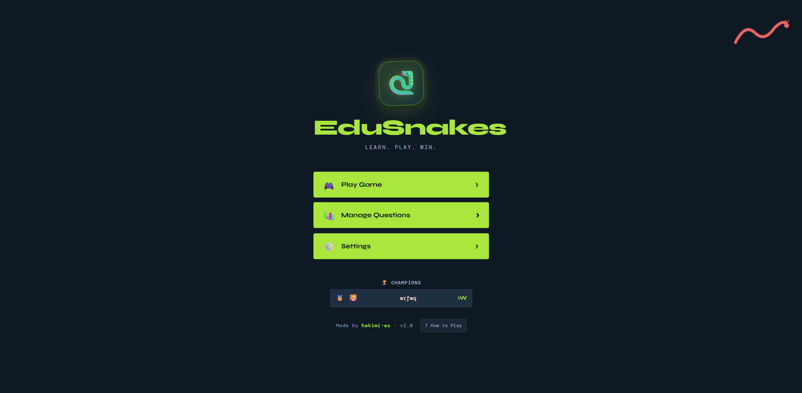
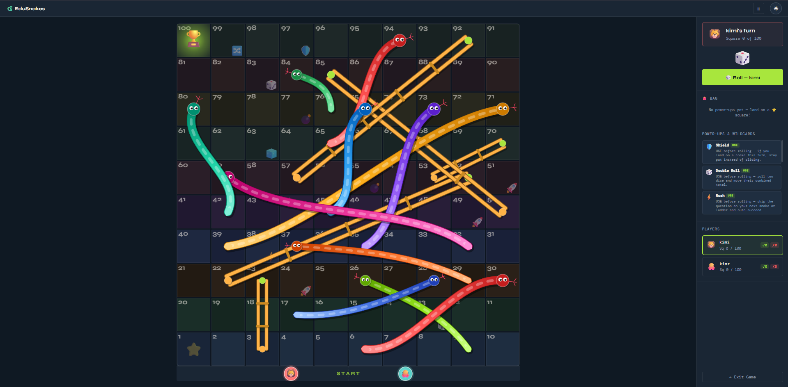
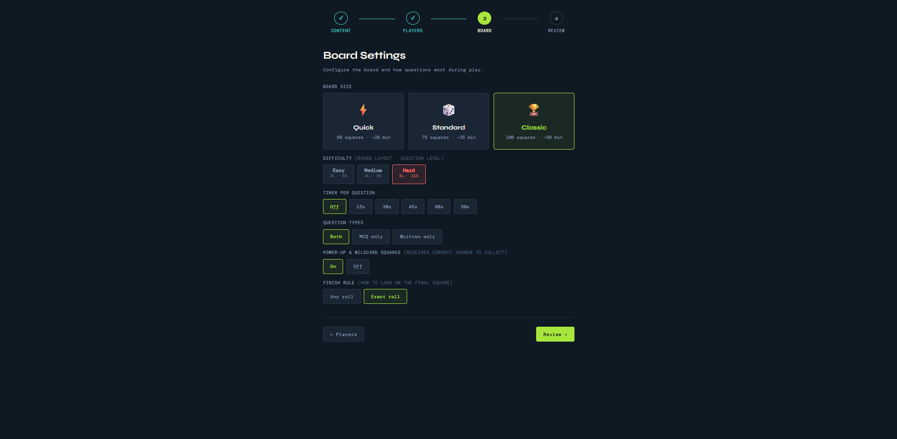
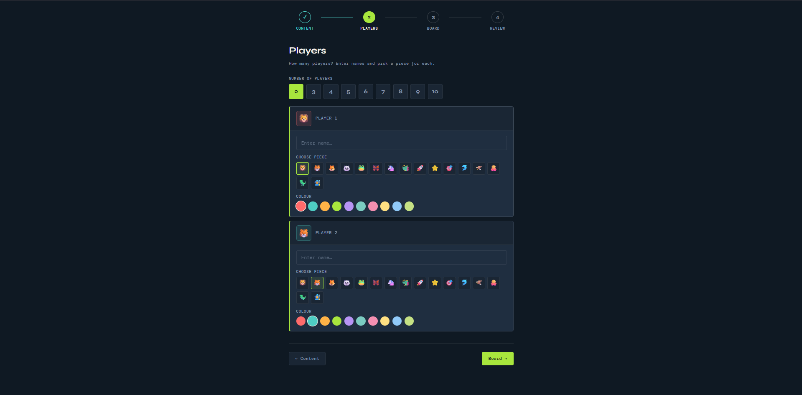
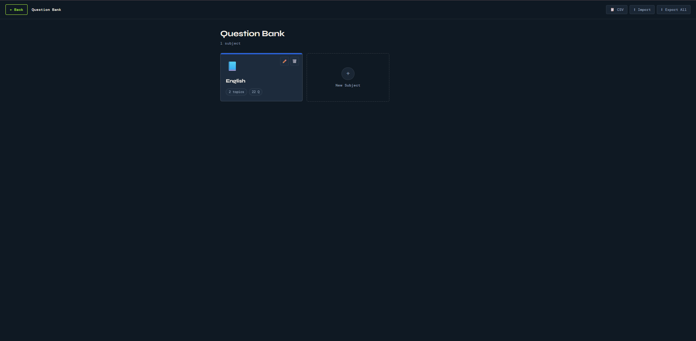
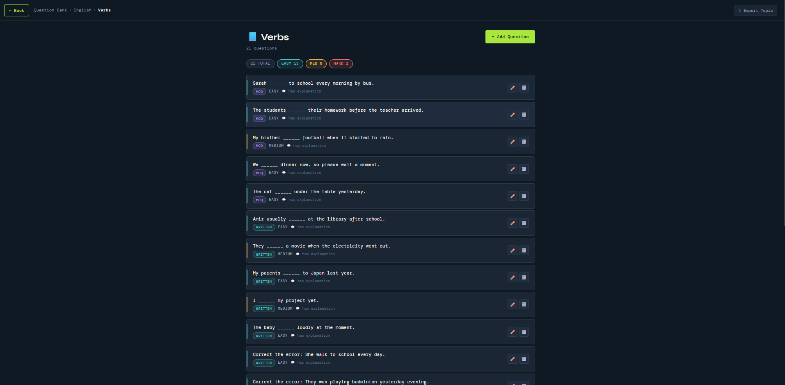
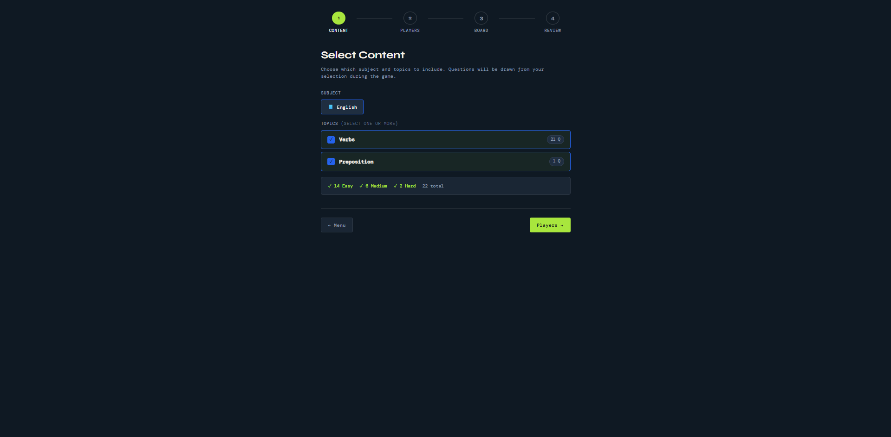
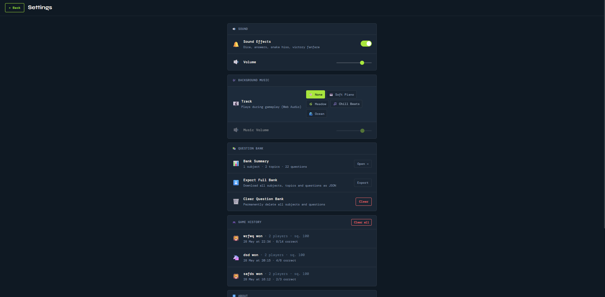

# 🐍 EduSnakes

> **Learn. Play. Win.** — A classroom-ready educational game built on the classic Snakes & Ladders board, where every snake bite and ladder climb is earned through answering questions.



---

## What Is EduSnakes?

EduSnakes turns any subject into an interactive multiplayer board game. Teachers load their own question bank — vocabulary, grammar, maths, science, history, anything — and students compete on a dynamically generated Snakes & Ladders board where knowledge is the only way to advance.

Designed for **classrooms, tutoring sessions, language labs, and group revision**, EduSnakes replaces passive review with active, competitive play. Players answer questions to climb ladders, escape snakes, and unlock power-ups — making learning feel like a game, because it is one.

### Who Is It For?

| Audience | Use Case |
|---|---|
| **Teachers & Lecturers** | End-of-lesson review, vocabulary drills, grammar practice |
| **Tutors** | Engaging revision sessions for 2–10 students |
| **Language Schools** | Fill-in-the-blank, tense correction, comprehension MCQs |
| **Students** | Self-study or peer-to-peer competitive revision |
| **Corporate Trainers** | Team-building quizzes, onboarding knowledge checks |

---

## Screenshots

<table>
  <tr>
    <td align="center"><br/><sub>Main Menu with Champions Leaderboard</sub></td>
    <td align="center"><br/><sub>Live Game Board — coloured snakes, gold ladders, player tokens</sub></td>
  </tr>
  <tr>
    <td align="center"><br/><sub>Board Settings — size, difficulty, timer, rules</sub></td>
    <td align="center"><br/><sub>Player Setup — up to 10 players, custom emoji &amp; colour</sub></td>
  </tr>
  <tr>
    <td align="center"><br/><sub>Question Bank — subjects &amp; topics</sub></td>
    <td align="center"><br/><sub>Question List — MCQ &amp; written, with difficulty tags</sub></td>
  </tr>
  <tr>
    <td align="center"><br/><sub>Game Setup — pick which topics to play</sub></td>
    <td align="center"><br/><sub>Settings — audio, history, question bank management</sub></td>
  </tr>
</table>

---

## Features

### 🎮 Gameplay
- **Dynamic board generation** — every game produces a fresh snake & ladder layout, seeded by board size and difficulty
- **Answer to progress** — land on a ladder → answer correctly to climb; land on a snake → answer correctly to escape
- **Finish gate** — must answer a question correctly to win from the final square; wrong = bounce back
- **Streak bonus** — 3 correct answers in a row earns a free extra roll
- **Pause / resume** — press `Esc` or the ⏸ button to freeze the game at any time

### 🐍 Board
| Board | Squares | Est. Time |
|---|---|---|
| Quick | 50 | ~20 min |
| Standard | 75 | ~35 min |
| Classic | 100 | ~50 min |

- **3 difficulty levels** — each changes the snake/ladder count (Easy: fewer snakes, Hard: more snakes concentrated in the second half for late-game intensity)
- **10 distinct snake colours** — no two snakes look the same on the board
- **Anti-crowding layout engine** — a 2D spatial constraint prevents snake and ladder heads from clustering in the same area

### ⭐ Power-ups & Wildcards
Players land on special squares that add strategy and surprise to every session.

**Power-ups** — answer correctly to earn, then USE manually on your turn:

| Power-up | Effect |
|---|---|
| 🛡️ Shield | If you land on a snake this turn, stay put instead of sliding |
| 🎲 Double Roll | Roll two dice — move their combined total |
| ⚡ Rush | Skip the question on your next snake or ladder |
| 💣 Bomb | Pick any rival and blast them back 8 squares |
| ⏰ Extra Time | Double the timer on your next question *(timer games only)* |
| 🚀 Catapult | Leap forward 5 squares — replaces your roll |
| 🧊 Freeze | The next player skips their upcoming turn |

**Wildcards** — automatic events that trigger on landing:

| Wildcard | Effect |
|---|---|
| 🎲 Roll Again! | Take another roll immediately |
| 😱 All Back 5! | Every other player moves back 5 squares |
| 🔀 Swap with Leader! | Switch positions with the highest-ranked player |
| 🚀 Shortcut +8! | Zoom ahead 8 squares |
| 🌀 Chaos! | All player positions get shuffled randomly |

### 📚 Question Bank
- Organised as **Subjects → Topics → Questions**
- **MCQ** (4-option multiple choice) and **Written** (free-text) question types
- **3 difficulty levels** per question: Easy, Medium, Hard
- Optional **explanation** shown after answering
- Import/export the full bank as **JSON**
- Import questions in bulk from **CSV** (`text, type, difficulty, answer, optA–optD, explanation`)
- Topic-level and subject-level export for sharing between devices

### 👥 Players
- 2–10 players per game
- Each player picks a **custom emoji piece** (16 options) and **token colour**
- Tokens are rendered on the canvas with glow rings and emoji faces
- Up to 2 power-ups stored in each player's bag at once

### 🎯 Game Setup Wizard (4 steps)
1. **Content** — select subject and one or more topics; see question count by difficulty
2. **Players** — set player count, names, emoji, and colour
3. **Board** — board size, difficulty, timer per question, question types, power-up toggle, finish rule
4. **Review** — summary of all settings before launching

### 📊 Post-Game Summary
- 🏆 Winner hero card with accuracy and turns taken
- 🏅 Final rankings with correct/wrong/accuracy per player
- 📊 **Learning Insights** — per-player correct/total breakdown by topic, with colour-coded progress bars (green ≥70%, amber ≥40%, red <40%)
- 📋 Full question log showing every question asked, who answered, and whether they got it right
- 🎖️ Auto-awarded achievement badges: Scholar, Sharpshooter, On Fire, Determined, Lucky

### 🔁 Replay Options
- **🔁 Same Board** — rematch on the exact same snake/ladder layout
- **🎲 New Board** — generate a fresh board with the same settings

### 🏆 Leaderboard
- Persistent all-time champions table shown on the main menu
- Top 5 players ranked by total wins across all sessions
- Stored in browser `localStorage` — no server needed

### 🔊 Audio
- Fully synthesised sound effects via the **Web Audio API** — no audio files to download
- Distinct sounds for: dice roll, token step, correct answer, wrong answer, snake slide, ladder climb, win fanfare, timer tick
- Unique sound for every power-up activation
- 4 procedurally generated background music tracks: Soft Piano, Meadow, Chill Beats, Ocean
- Independent volume controls for SFX and music

### 🌙 Themes
- Dark mode (default) and light mode
- Toggle with the ☀/🌙 button in the game topbar

---

## Getting Started

EduSnakes is a **zero-dependency single HTML file**. No installation, no build step, no server required.

```bash
# Clone the repo
git clone https://github.com/hakimi-as/edusnakes.git
cd edusnakes

# Open in browser — that's it
open index.html
```

Or simply **double-click `index.html`** in your file explorer.

All data (question bank, game history, leaderboard, preferences) is stored in the browser's `localStorage` and persists between sessions automatically.

---

## Teacher Quick-Start Guide

### Step 1 — Build Your Question Bank

1. Click **Manage Questions** from the main menu
2. Create a **Subject** (e.g. "English Language")
3. Add **Topics** inside it (e.g. "Present Tense Verbs", "Prepositions")
4. Add questions to each topic — MCQ or written, with optional explanations

**Tip:** Use the **CSV Import** button to bulk-load questions from a spreadsheet. Format:
```
text,type,difficulty,answer,optA,optB,optC,optD,explanation
"She __ to school every day.",objective,easy,0,goes,go,going,gone,"3rd person singular takes 's'"
"Correct the verb: They was playing.",written,medium,"were playing",,,,,
```

### Step 2 — Configure the Game

1. Click **Play Game**
2. Select your subject and the topics you want to drill
3. Set player names (one per student, team, or seat)
4. Choose board size, difficulty, and timer pressure to match your lesson's goals

### Step 3 — Play

Project the screen at the front of the class. Students take turns rolling the dice on the shared device, or rotate a tablet/laptop between seats. The question popup appears automatically — students answer before time runs out.

### Step 4 — Review

After the game, walk through the **Learning Insights** panel together. It shows exactly which topics each student struggled with — instant formative assessment.

---

## Keyboard Shortcuts

| Key | Action |
|---|---|
| `Space` / `Enter` | Roll the dice (when it's your turn) |
| `Esc` | Pause/resume game · Close modals |

---

## File Structure

```
edusnakes/
├── index.html          # The entire application (HTML + CSS + JS, ~6 400 lines)
├── questions-english-verbs.json   # Sample question bank (importable)
└── README.md
```

EduSnakes is intentionally kept as a **single file** so it can be opened from a USB drive, shared via email, or hosted on any static server with zero configuration.

---

## Tech Stack

| Layer | Technology |
|---|---|
| Structure | Vanilla HTML5 |
| Styling | CSS custom properties, CSS Grid, Flexbox |
| Logic | Vanilla JavaScript (ES2020) |
| Graphics | HTML5 Canvas 2D API |
| Audio | Web Audio API (fully synthesised — no audio files) |
| Persistence | `localStorage` |
| Fonts | Google Fonts (Syne, DM Sans) |
| Dependencies | **None** |

---

## Browser Compatibility

Works in any modern browser that supports the Web Audio API and Canvas 2D.

| Chrome | Firefox | Safari | Edge |
|---|---|---|---|
| ✅ 90+ | ✅ 88+ | ✅ 14+ | ✅ 90+ |

> Mobile browsers are supported. For classroom use, a laptop or tablet projected to a screen is recommended.

---

## Roadmap / Ideas

- [ ] Teacher dashboard with exportable CSV results per session
- [ ] QR code to join games on students' own devices
- [ ] Image support for questions (diagrams, photos)
- [ ] Timer leaderboard (fastest correct answer wins bonus points)
- [ ] Offline PWA support

---

## Contributing

Contributions, bug reports, and feature suggestions are welcome.

1. Fork the repo
2. Create a feature branch (`git checkout -b feature/my-feature`)
3. Commit your changes
4. Open a pull request

---

## License

MIT License — free to use, modify, and distribute for personal, educational, and commercial purposes.

---

## Author

Made by **hakimi-as** · v2.0

*Built for teachers, played by students.*
